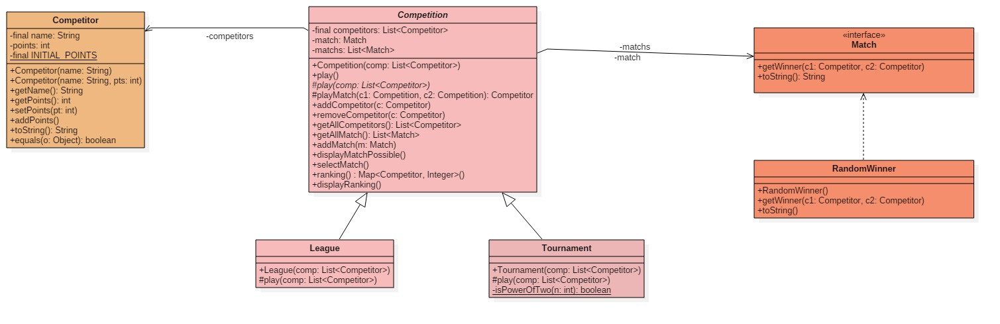

# Projet : Compétitions

## Membres :

* Chaïma BOUDEHANE
* Yannick MOUNGUENGUI


## How To  

## Récupérer le projet  

```bash
git clone git@gitlab-etu.fil.univ-lille.fr:chaima.boudehane.etu/Boudehane_Mounguengui-COO.git
```

*se placer dans le répertoire*  

```bash
cd Boudehane_Mounguengui-COO/Projet
```

# Avec le Makefile

## Génération et consultation de la documentation  

*générer*

```bash
make doc
```  

*consulter*

Ouvrir le fichier **index.html** situé dans le dossier **/doc** dans le navigateur.    

## Compilation du code source  

```bash
make cls
```

## Génération et exécution de l'archive

*construction du jar*  

```bash
make competition.jar
```  

*exécution du jar*  

```bash
make competition
```

## Exécution des tests  

```bash
make test
```

## Nettoyer les fichiers  

```bash
make clean
```  

**NB: vous pouvez faire la commande `make` directement pour générer la documentation et le jar en une seule fois**    


# Sans Makefile  

## Génération et consultation de la documentation  

*générer*  

```bash
javadoc -sourcepath src -d doc -subpackages main
```

*consulter*    
  
Ouvrir le fichier **index.html** situé dans le dossier **/doc** dans le navigateur.


## Compilation du code source  

```bash
javac -sourcepath src -d classes src/main/*.java
```

## Génération et exécution de l'archive

*construction du jar*  

```bash
jar cvfe competition.jar main.CompetitionMain -C classes main
```  

*exécution du jar*  

```bash
java -jar competition.jar
```

## Compilation et exécution des tests  

*compiler*  

```bash
javac -d classes -classpath ./lib/junit-platform-console-standalone-1.9.0.jar ./src/main/*.java  ./src/main/competitions/*.java ./src/main/strategy/*.java ./src/main/exceptions/*.java ./src/main/util/*.java ./test/main/*.java ./test/main/competitions/*.java ./test/main/mocks/*.java ./test/main/strategy/*.java
```

*exécuter*  

```bash
java -jar ./lib/junit-platform-console-standalone-1.9.0.jar -cp classes --scan-classpath --disable-banner
```  

## Nettoyer les fichiers  

```bash  
rm -r doc classes competition.jar
```

# Livrables  

## Livrable 1

    

## Choix de conception  

### Méthode play dans Tournament

Nous complété les classes filles Tournament et League qui héritent de Competition, notamment leur méthode `play`.
Pour Tournament, nous avons utilisé une liste chaînée, qui semble être une solution logique pour pouvoir modéliser un tournoi. On récupère à chaque fois les 2 premiers éléments de la liste et on les fait s'affronter `(playMatch())` pour obtenir le gagnant. Enfin, nous ajoutons ce dernier en queue de liste pour pouvoir recommencer (voir le pseudo code ci-dessous).


```
Initialisation de la liste chaînée et affectation à la liste de compétiteurs
 TANT QUE la taille de la liste chaînée est différente de 1 :  
 |  Retirer l'élément en tête de liste et l'affecter au premier compétiteur
 |  Retirer l'élément en tête de liste et l'affecter au second compétiteur
 |  Récupérer le gagnant du match
 |  Ajouter ce gagnant en queue de liste
 |      
 Retirer le gagnant de la liste chaînée
 Afficher le gagnant du tournoi
```  


### Les différents types de match

Nous avons pensé qu'il serait plus judicieux de créer une interface `Match`, qui serait uniquement composée de 2 méthodes : `getWinner(c1 : Competitor, c2 : Competitor)` et `toString()`. Une classe nommée RandomWinner implémente cette interface afin de définir ces méthodes. Nous avons réfléchi sur le fait que plusieurs types de match, c'est à dire, de manières de déterminer le gagnant, peuvent changer par la suite. Et nous trouvons qu'il est préférable de préparer cette éventualité qui ainsi permettra de créer d'autres types de match différents de `RandomWinner`.
*Exemple : une classe CheatedWinner dont la méthode getWinner déterminera le gagnant à l'avance comme c1 par exemple*  


Nous avons créé une référence à Match dans Competition par le biais d'un attribut match (initialisé à `null` dans le constructeur).
La méthode selectMatch() permet à l'utilisateur de choisir le type de match qu'il souhaite pour n'importe quelle compétition (pour l'instant il n'y a qu'un type de match).  

Cette idée de conception a pour but de simplifier la méthode `playMatch`. Celle-ci n'aura qu'une ligne de code qui consistera à afficher le gagnant selon le type de match choisi par l'utilisateur : elle appelle la méthode getWinner spécifique au type de match.   

  
### Mocks et classes de tests abstraites  

Nous avons utilisé des Mocks afin de tester les appels de certaines méthodes : `MockCompetition` et `MockMatch` permettent de vérifier l'appel de méthodes telles que play, playMatch, displayMatchPossible, etc...

De plus, nous avons créé une classe de tests abstraite `CompetitionTest`, car nous savons que League et Tournament héritent de Competition dans le code source. Cela permettra à LeagueTest et TournamentTest d'hériter de ces méthodes de test qui, pour la plupart sont identiques. 


